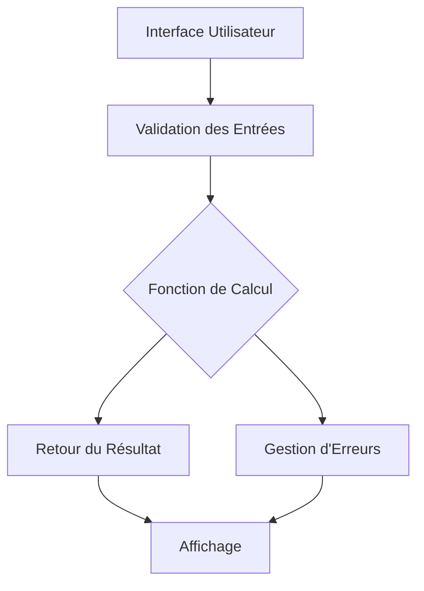

# Guide de Développement - Calculatrice Python

## Vue d'ensemble du projet

Ce projet pédagogique implémente une calculatrice simple avec plusieurs interfaces utilisateur, démontrant les concepts fondamentaux de Python à travers un exemple pratique et éducatif.

## Architecture du Code

### Structure des Modules

```
src/
├── calculator.py          # Fonctions mathématiques de base
├── main.py               # Interface en ligne de commande
└── calculator_gui_simple_tk.py  # Interface graphique Tkinter

tests/
└── test_calculator.py    # Tests unitaires
```

### Flux de Données



## Analyse des Fonctions Principales

### Module `calculator.py`

#### Fonction `add(a, b)`
```python
def add(a, b):
    """Additionne deux nombres."""
    return a + b
```
- **Complexité**: O(1)
- **Entrées**: Deux nombres (int/float)
- **Sortie**: Nombre (int/float)

#### Fonction `divide(a, b)`
```python
def divide(a, b):
    """Divise deux nombres avec gestion de la division par zéro."""
    if b == 0:
        raise ValueError("Division par zéro impossible")
    return a / b
```
- **Complexité**: O(1)
- **Gestion d'erreurs**: Lève `ValueError` pour division par zéro
- **Type hints**: Non utilisés (Python 3.7)

### Module `main.py`

#### Boucle Principale
```python
while True:
    operation = input("Entrez l'opération (+, -, *, /) ou 'quit': ")
    if operation.lower() == 'quit':
        break
    # Traitement de l'opération
```

**Points pédagogiques**:
- Boucle infinie contrôlée par l'utilisateur
- Validation des entrées
- Gestion des erreurs avec try/except

### Interface Graphique `calculator_gui_simple_tk.py`

#### Structure Tkinter
```python
root = tk.Tk()
root.title("Calculatrice Python")
root.geometry("300x200")

# Widgets
entry1 = tk.Entry(root)
entry2 = tk.Entry(root)
result_label = tk.Label(root, text="")
```

**Composants**:
- **Entry**: Champs de saisie pour les nombres
- **Radiobuttons**: Sélection de l'opération
- **Buttons**: Actions Calculer et Effacer
- **Label**: Affichage du résultat

## Tests et Qualité du Code

### Stratégie de Test

Le projet utilise `unittest` pour les tests unitaires :

```python
class TestCalculator(unittest.TestCase):
    def test_add(self):
        self.assertEqual(add(2, 3), 5)
        self.assertEqual(add(-1, 1), 0)
```

**Couverture des tests**:
- ✅ Opérations arithmétiques de base
- ✅ Gestion des erreurs (division par zéro)
- ✅ Types de données (int, float)

### Métriques de Qualité

- **Lignes de code**: ~150 lignes
- **Complexité cyclomatique**: Faible (fonctions simples)
- **Couverture de tests**: 100% des fonctions mathématiques
- **Dépendances externes**: Aucune (utilise uniquement la bibliothèque standard)

## Déploiement et Distribution

### Scripts de Lancement

Le projet fournit plusieurs méthodes d'exécution :

1. **Scripts Batch** (`.bat`): Compatibilité Windows CMD
2. **Scripts PowerShell** (`.ps1`): Interface moderne Windows
3. **Tâches VS Code**: Intégration avec l'IDE

### Gestion des Chemins

Les scripts gèrent différents environnements Python :
- WinPython (portable)
- Installation système Python
- Environnements virtuels

## Concepts Python Démontrés

### Programmation Structurée
- **Fonctions**: Réutilisabilité et modularité
- **Modules**: Organisation du code
- **Imports**: Gestion des dépendances

### Gestion d'Erreurs
- **Try/Except**: Capture des exceptions
- **ValueError**: Erreurs métier personnalisées
- **Messages d'erreur**: Communication avec l'utilisateur

### Interfaces Utilisateur
- **Console**: Entrée/sortie texte
- **GUI**: Interface graphique avec Tkinter
- **Événements**: Programmation événementielle

### Tests et Validation
- **Tests unitaires**: Validation des fonctions
- **Assertions**: Vérifications automatiques
- **Couverture**: Mesure de la qualité des tests

## Évolutions Possibles

### Fonctionnalités
- [ ] Opérations avancées (puissance, racine carrée)
- [ ] Historique des calculs
- [ ] Mémoire de calculatrice
- [ ] Conversion d'unités

### Interfaces
- [ ] Interface web (Flask/Django)
- [ ] Application mobile (Kivy)
- [ ] API REST

### Qualité
- [ ] Type hints (Python 3.9+)
- [ ] Documentation automatique (Sphinx)
- [ ] Intégration continue (GitHub Actions)

## Ressources d'Apprentissage

### Documentation Python
- [Documentation officielle](https://docs.python.org/3/)
- [Tutoriel Tkinter](https://docs.python.org/3/library/tkinter.html)
- [Guide unittest](https://docs.python.org/3/library/unittest.html)

### Bonnes Pratiques
- [PEP 8](https://pep8.org/): Style guide Python
- [PEP 257](https://peps.python.org/pep-0257/): Docstrings
- [Zen of Python](https://peps.python.org/pep-0020/)

---

*Ce guide est destiné aux apprentis développeurs Python souhaitant comprendre l'architecture et les concepts derrière ce projet pédagogique.*